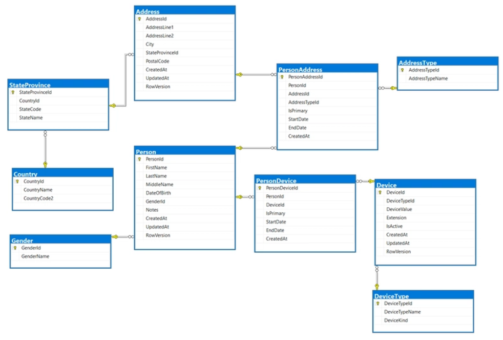

# About

A SqlLite database sample originally done with SQL-Server. Database was converted using a converter tool.

## Article

[Pushing skills to a new level](https://dev.to/karenpayneoregon/pushing-skills-to-a-new-level-5cdj)

As a developer, a professional, or just starting out, you must continually learn and hone your craft. There is a great way to accomplish this: first, write down objectives, then create a side project.

The objective here is to create a contact solution using a SQL Server relational database and Microsoft EF Core to interact with it, implemented in a class project.

