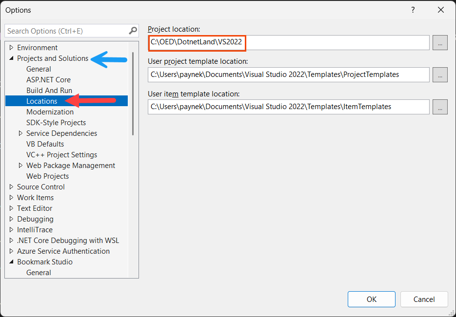

# Visual Studio Options

## Project Locations

By default, the project location is under the user profile `C:\Users…`, which can be problematic. To prevent issues, set the default project location under `C:\OED`, as shown in the screenshot below, which uses C:\OED\DotnetLand as the base folder. `C:\OED\DotnetLand\VS2022` is for projects created with `VS2022`. When moving to `VS2026`, create that folder, as there will be enough differences between `VS2022` and `VS2026` that it's worth separating newer projects.

